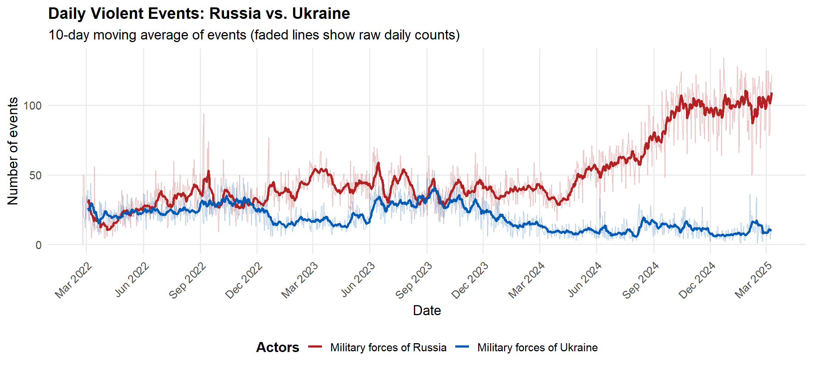
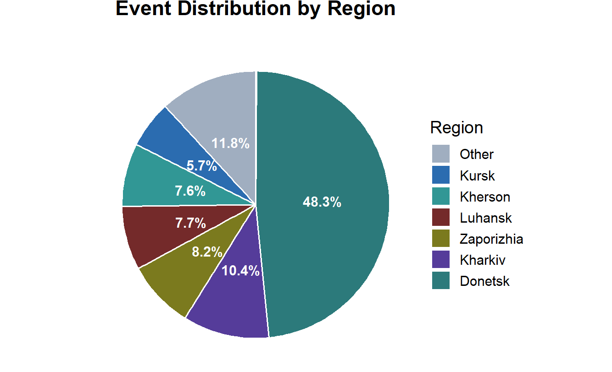
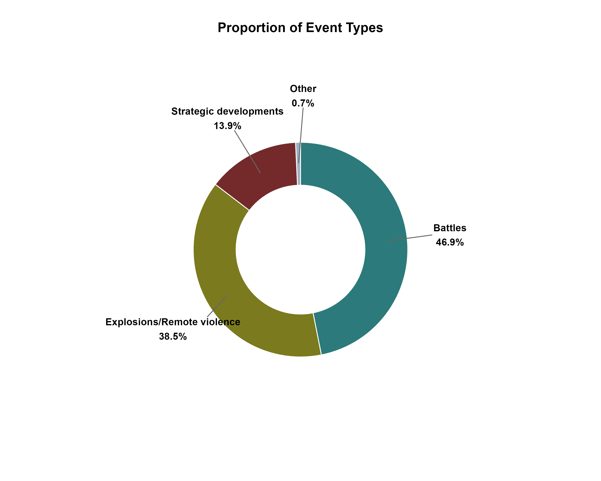
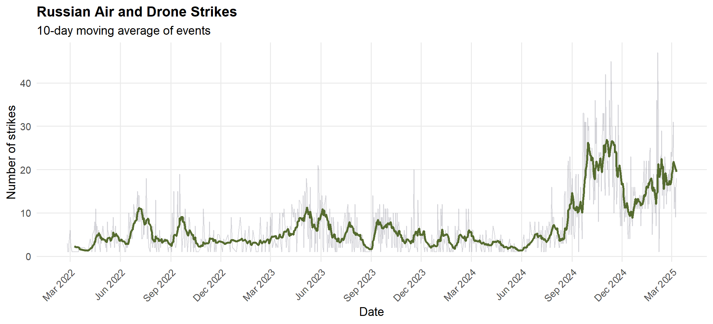
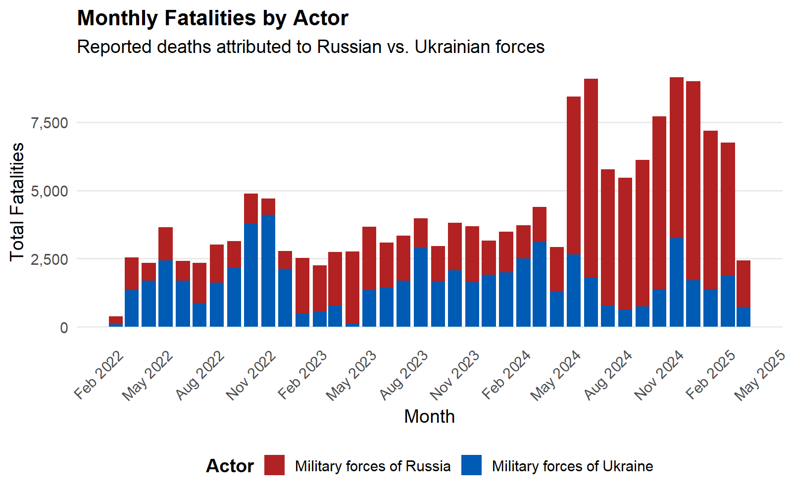
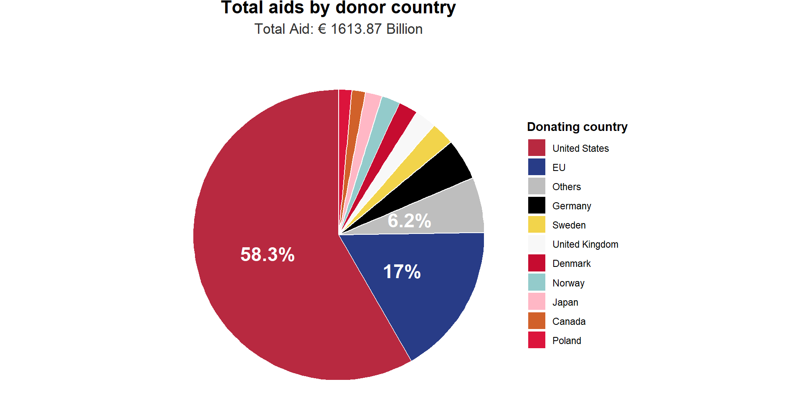
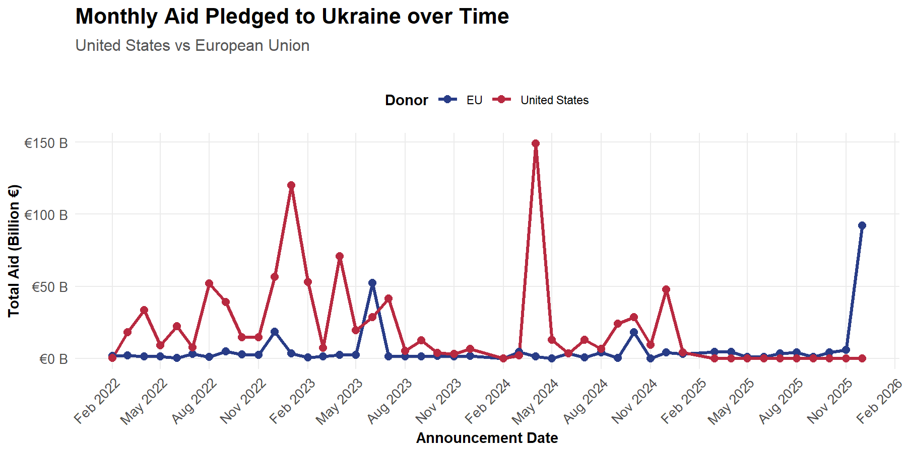
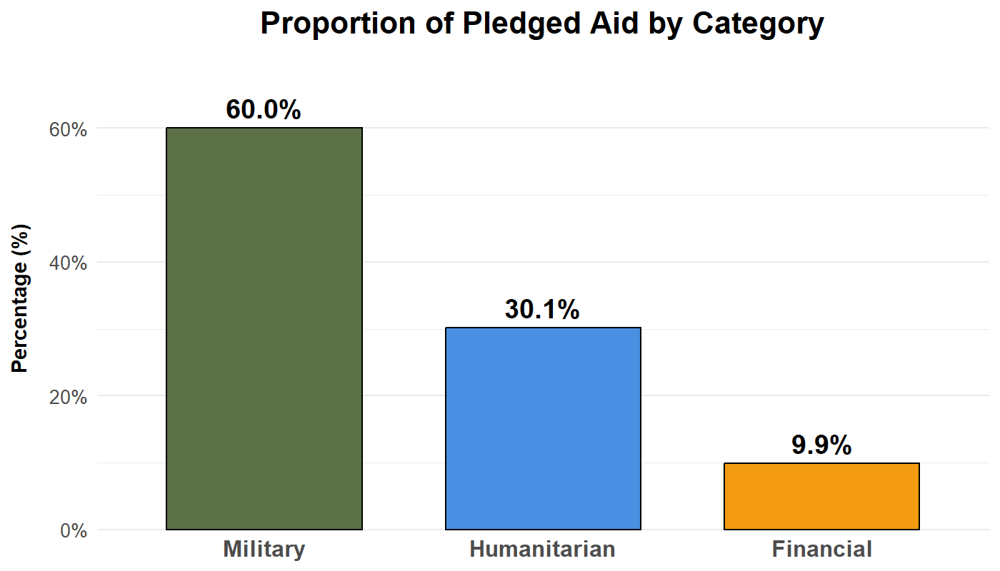

# Project of Data Visualization (COM-480)

| Student's name  | SCIPER |
|-----------------|--------|
| Daniele Giuli   | 395832 |
| Chaewon Yoon    | 423059 |
| Ali Shenaskhosh | 389834 |

[Milestone 1](#milestone-1) • [Milestone 2](#milestone-2) • [Milestone 3](#milestone-3)

## Milestone 1 (20th March, 5pm)

> **10% of the final grade**

> This is a preliminary milestone to let you set up goals for your final project and assess the feasibility of your ideas. Please, fill the following sections about your project.

> *(max. 2000 characters per section)*

The conflict in Ukraine represents a critical geopolitical crisis with a vast but often fragmented landscape of information. This project aims to bridge the gap between raw data and public understanding by developing an interactive, data-driven platform that provides a multi-faceted analysis of the war.

Our goal is to move beyond static reporting, offering a comprehensive visualization of the conflict’s evolution through four main pillars:

Military Dynamics: Visualizing the shifting battlefronts and tactical engagements over time.

Human Impact: Tracking casualties and the humanitarian cost of the escalation.

Financial & Material Support: Mapping the flow of international aid and military equipment.

Geopolitical Context: Analyzing the diplomatic shifts and alliances surrounding the crisis.

### Dataset

> Find a dataset (or multiple) that you will explore. Assess the quality of the data it contains and how much preprocessing / data-cleaning it will require before tackling visualization. We recommend using a standard dataset as this course is not about scraping nor data processing.
>
> Hint: some good pointers for finding quality publicly available datasets ([Google dataset search](https://datasetsearch.research.google.com/), [Kaggle](https://www.kaggle.com/datasets), [OpenSwissData](https://opendata.swiss/en/), [SNAP](https://snap.stanford.edu/data/) and [FiveThirtyEight](https://data.fivethirtyeight.com/)).

Dataset

To provide a multi-dimensional analysis of the Ukraine conflict, we have selected several authoritative and standardized datasets that cover military, humanitarian, and economic aspects:

## Military Dynamics & Casualties

-   ACLED (Armed Conflict Location & Event Data Project) : Provides georeferenced data on specific military actions, battles, and explosions. https://acleddata.com/conflict-data/download-data-files

-   UCDP GED (Georeferenced Event Dataset) : Offers high-quality, event-based data to track precise casualty figures and instances of one-sided violence. https://ucdp.uu.se/downloads/#section-other

## International Support & Sanctions

-   Ukraine Support Tracker (Kiel Institute) : Tracks financial, humanitarian, and military aid pledged by various countries. https://www.ifw-kiel.de/publications/ukraine-support-tracker-data-6453/

-   OpenSanctions (Ukraine War Sanctions) : A curated dataset of individuals and entities targeted by international sanctions. https://www.opensanctions.org/datasets/ua_war_sanctions/

## Economic Impact & Territorial Changes:

-   COW (Correlates of War) Bilateral Trade : Used to assess shifts in global trade patterns and the economic consequences of the war. https://correlatesofwar.org/data-sets/

-   DeepStateMap/ISW Geospatial Data : Open-source data to visualize the temporal shifts of the battlefront and territorial control. https://t.me/DeepStateUA

Data Quality Assessment

These datasets are widely recognized as "gold standards" in political science and conflict research. ACLED and UCDP provide rigorous, cross-verified event logs, while the Kiel Institute’s tracker is the most comprehensive source for aid transparency. The data quality is high, minimizing the risk of misinformation common in active conflict reporting.

Preprocessing & Data Cleaning

1.  Normalization : Aligning timestamps (daily events vs. monthly/periodic reports) to a unified interactive timeline.
2.  Geospatial Join : Mapping event-based coordinates from ACLED/UCDP onto the territorial polygons derived from DeepStateMap to ensure visual consistency.
3.  Entity Linking: Connecting sanctioned entities from OpenSanctions with economic indicators to visualize the correlation between legal pressure and economic shifts.

### Problematic

> Frame the general topic of your visualization and the main axis that you want to develop. - What am I trying to show with my visualization? - Think of an overview for the project, your motivation, and the target audience.

The Russian invasion of Ukraine began on 24 February 2022. The invasion not only impacted the two warring countries, but it had a worldwide effect as it both sides draw support from their allies. As a result of its global impact, the conflict has garnered worldwide attention and extensive coverage. Our goal is to move beyond static reporting, offering a comprehensive visualization of the conflict’s evolution through four main pillars:

## Military Dynamics

-   This is the most basic aspect of any war. We want to visualize the shifting battlefronts and tactical engagements over time. Withthe use of this visualization we will be able to see the progress of the war, the advances and retreats of armies and the occupation of territories.

-   Also, it will help us understand which operations and engagements resulted in success and which have failed. Moreover, we can analyze if the conflict has transformed into an attrition warfare or not. For this purpose the data on the violent events is used.

## Human Impact

-   The war had devastating humanitarian impact on both sides. In addition to the large number of military casualties and injuries, There has been a significant number of civilian deaths. As a result, we will analyze the the data on the casualties of both side and would visualize the evolution of the loss of life through the war.

-   At the same time, we are interested to show which age groups have been more intensely affected by the war. In addition to the loss of life, the war resulted in displacement and migration of many people affected by war. The visualization would demonstrate the movement of these people to other places in Ukraine or to other countries around the world.

## Financial & Material Support

-   Since start of the war Ukraine relied heavily on the financial support and military aid of its allies especially US and EU. This supports usually come in the form of direct financial aid for military or humanitarian purposes or military equipment. Thereofre, the data will be analyzed to demonstrate the origin of the aid given to Ukraine.

-   In addition, we will analyze the purpose of the aid given and whether it was military or financial or humanitarian aid.

-   On the other hand Russia at the beginning relied on finances built over years from selling oil and natural gas. Moreover, it had access to the large albeit outdated reserve of Soviet military equipment. As the war dragged on longer than expected, Russia purchased equipment from various countries and even used manpower provided by North Korea. Therefore one goal of the visualization is mapping the flow of international aid and military equipment to determine how much and what kind of aid each country received during the course war and who were the biggest contributors on each side.

## Geopolitical Context

-   As stated earlier, the conflict had a global impact. Some countries clearly took sides while other tried a more pragmatic approach. Some of these stances changed over the course of war while the rest remained the same. Analyzing thees diplomatic shifts and alliances surrounding the crisis is one of the goals of this project.

### Exploratory Data Analysis

> Pre-processing of the data set you chose - Show some basic statistics and get insights about the data

In this section we will make an initial analysis of some of the available data and create some simple visualization to demonstrate basic statistics of the data regarding some of the mentioned aspects of our project.

As shown in Fig. 1, overall through the course of war, the number of violent events caused by Russian military was higher than Ukraine. Moreover, since beginning of 2024, there has been a decrease in the number of operations of the Ukraine. Meanwhile, the Russians have intensified their attacks in that time, reaching a peak of about 100 daily events caused by them. This number is more than double the average of operations done by Russian military in the period before.

The above pie chart shows what percentage of the violent events happened in each impacted region. Kursk is a Russian Oblast, Luhansk is completely occupied by Russia, Kharkiv was occupied at the beginning and was later liberated, and the rest are currently partially occupied by Russia. Nearly half of the events happen at Dontesk Oblast showing that this region is where the fighting is most intense. On the other hand less than 15 percent of the events happen at the regions completely controlled by Russia Suggesting there are much fewer events directed toward Russian soil.

Figure 3 demonstrates how much share each category of events has. Nearly half of the violent events were battles meaning they happened on the frontlines of the war. On the other hand, about 40 percent were explosions or remote violence. This includes aerial bombing, artillery shelling, missile attack, use of drones, planting bombs and other similar methods.

From figure 4. we can see the number of the aerial and drone strikes done by the Russian military has intensified since the later part of 2024 and reached its all time high towards the end of the year. This data alongside figure 1 shows that the Russian military heavily intensified its attacks in 2024, tying to achieve a breakthrough. On the other hand, the Ukranian Army has been in a more defensive position since then and the number of violent events initiated by it has been reduced significantly.

The humanitarian toll of war was another aspects that we are interested in analyzing. One of the first steps is to analyze the casualties suffered by each side during the war. The following histogram shows the number fatalities on each side from the beginning of war.

For most of the war, the Ukranian military suffered more casualties on average. But since the middle of 2024, the Russian military has suffered a much higher number of deaths than Ukraine and than it's average before. This is line with the analysis we made earlier and what the other data also show: During 2024 Russian military intensified its attacks in order to achieve a breakthrough and the Ukranian military has been mostly on defensive. The high rate of casualties coupled with the fact that most of the violent events were initiated by the Russian military, suggests that the Russians were mostly unsuccessful in their operations. Although for more accuracy the battlefront map should be analyzed.

We also want to analyze the aid and support given to countries. The following pie chart shows share of the each country of the total aid given to Ukraine.

As the chart demonstrates, United States is by far the largest donor to Ukraine, contributing about 60 percent of the total amount. Most of the remaining aid is given by EU or its member countries individually. In figure 7 we can see how the aid given by EU and US has changed over time:

Finally, We are interested in the type of aid that Ukraine has received. Using figure 8 we can see that the largest portion is dedicated to military aid, constituting 60 percent of the aid received by Ukraine. Next, 30 percent of the total aid is humanitarian aid, and just 10 percent of the aid is financial which goes toward the civilian administration of the country.

### Related work

> -   What others have already done with the data?
> -   Why is your approach original?
> -   What source of inspiration do you take? Visualizations that you found on other websites or magazines (might be unrelated to your data).
> -   In case you are using a dataset that you have already explored in another context (ML or ADA course, semester project...), you are required to share the report of that work to outline the differences with the submission for this class.

Since the war is an ongoing conflict and due to its important on a global scale, a large number of analysis has been done on the gathered data about the war. Some of the sources for chosen datasets also provide visualization of their data. for instance there are visualization available for the map of the battlefront and its evolution and for the aid given to Ukraine.

But while there are visualization available on the data, there is a lack of an analysis which unifies all these different aspects and reports their related data together. Our main objective in this project is to connect different aspects of the Ukraine war in a logical way and present the available data at one place.

For this reason we have chosen various datasets that cover the mentioned points of interest and we will use them to visualize and report an story about different sides of the war. This helps interested individuals to have a better understanding of the conflict as a whole and be able to access the data related to every feature of the war at one place. Using our intended visualization, one can use a comprehensive summary to better understand the war.

## Milestone 2 (17th April, 5pm)

**10% of the final grade**

## Milestone 3 (29th May, 5pm)

**80% of the final grade**

## Late policy

-   \< 24h: 80% of the grade for the milestone
-   \< 48h: 70% of the grade for the milestone